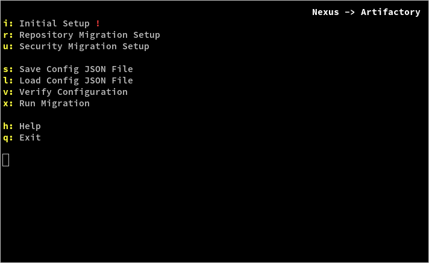
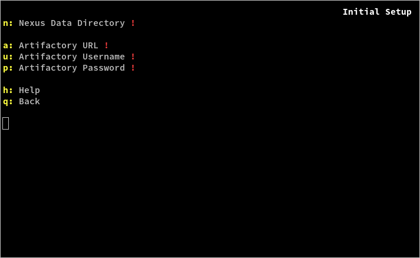
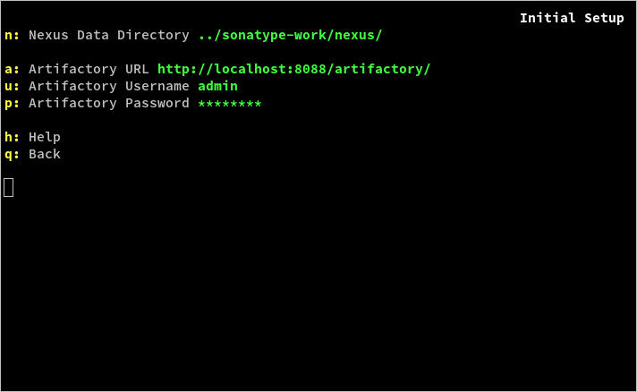
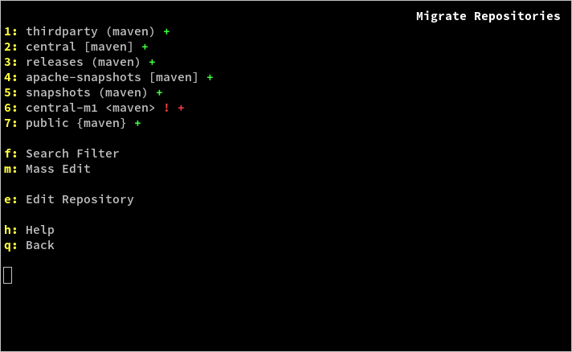

NexusToArtifactory
==================

This tool is designed to ease the transition from Sonatype Nexus to JFrog
Artifactory. It provides a simple wizard-like interface that allows you to
easily configure and run a migration of repositories, artifacts, users, and
settings from a Nexus instance to an Artifactory instance.

This tool is still in very early development, and may not yet have support for
everything that might need to be migrated. See the bottom of this page for
further details.

Currently, the following data can be migrated:
- local (hosted), remote (proxy), and virtual (group) repositories
- artifacts stored in local (hosted) repositories
- users, groups (roles), and permissions (privileges)
- LDAP configuration

Installation
------------

This tool accesses the Nexus instance directly by reading the Nexus files from
the disk. Therefore, the tool should be installed on the computer running the
Nexus instance, or on a computer with access to the filesystem that the Nexus
instance is installed on.

First, install the dependencies:
- the latest version of [Python 2][]
- the latest version of [PDCurses][] (on Windows only)

[Python 2]:  https://www.python.org/downloads/
[PDCurses]:  http://pdcurses.sourceforge.net/

Then, clone this repository.

Usage
-----

To run the tool, run `./NexusToArtifactory.py`.

All options can be accessed by typing the appropriate key on the keyboard. The
following options are available:
- <kbd>i</kbd> *Initial Setup* - Connect to the Nexus and Artifactory instances.
  This allows the tool to scan both, and come up with a default configuration
  for migration. This configuration can then be modified via the other options.
- <kbd>r</kbd> *Repository Migration Setup* - Allows you to specify which
  repositories should and should not be migrated. Also, allows you to modify any
  repository to some degree (changing the name, description, layout, etc). These
  changes only affect the current configuration, and will take effect on the
  Artifactory instance when the migration is run (the Nexus instance does not
  change).
- <kbd>s</kbd> *Save Configuration* - Allows you to save the current
  configuration to a JSON file. This way, you can close the tool and come back
  to it later, or you can save the current state of the migration to revert back
  to at a future time.
- <kbd>l</kbd> *Load Configuration* - Allows you to load a JSON file containing
  a configuration.
- <kbd>v</kbd> *Verify Configuration* - Rescan the Nexus and Artifactory
  instances, and reapply the current configuration. This should be used to check
  for incompatibilities after the Nexus instance has been modified.
- <kbd>x</kbd> *Run Migration* - Run the migration.
- <kbd>h</kbd> *Help* - Pressing another key after this one displays
  context-sensitive help for that option. **Note:** At the moment, no help pages
  are configured.
- <kbd>q</kbd> *Exit* - Quit the tool.

The first step is to connect to the Nexus and Artifactory instances, so type
<kbd>i</kbd> to open the Initial Setup menu.

The following options are available:
- <kbd>n</kbd> *Nexus Path* - The local filesystem path, where the Nexus
  instance is installed. This is generally a `sonatype-work/nexus/` folder. This
  path can be either a relative or absolute file path. If the path doesn't
  exist, or if it doesn't contain a valid Nexus install, this option will be
  hilighted in red.
- <kbd>a</kbd> *Artifactory URL* - The URL of the Artifactory instance. If the
  given URL is not a valid Artifactory instance, this option will be hilighted
  in red.
- <kbd>u</kbd> *Artifactory Username* - The username of an admin user on the
  given Artifactory instance.
- <kbd>p</kbd> *Artifactory Password* - The password of the admin user. Unless
  both the username and password are correct, they will both be hilighted in
  red.
- <kbd>h</kbd> *Help* - Pressing another key after this one displays
  context-sensitive help for that option. **Note:** At the moment, no help pages
  are configured.
- <kbd>q</kbd> *Back* - Go back to the main menu.

Once the Nexus and Artifactory instances have both been successfully connected,
type <kbd>q</kbd> to go back to the main menu.

By this point, the tool has generated an initial configuration for the
migration, and all the settings have been set accordingly, but sometimes the
default settings need to be modified further. If there are any settings that
need to be changed, the corresponding option will be marked with a red `!`.
These must be cleared before running the migration.

In the screenshot above, there is an error in the Repository Migration Setup
menu, so type <kbd>r</kbd> to enter that menu.

The following options are available:
- <kbd>1</kbd> *releases (maven)* - Typing a number key toggles whether to
  migrate the associated repository. The plus sign appears when the repository
  is to be migrated. This option also displays the package type, as well as
  whether the repository is a `(local)`, `[remote]`, `<shadow>`, or `{virtual}`.
  If there are a lot of repositories to show, they can be paged through using
  the left and right arrow keys.
- <kbd>e</kbd> *Edit Repository* - Typing <kbd>e</kbd> followed by a number
  allows you to edit the associated repository.
- <kbd>h</kbd> *Help* - Pressing another key after this one displays
  context-sensitive help for that option. **Note:** At the moment, no help pages
  are configured.
- <kbd>q</kbd> *Back* - Go back to the main menu.

The error turns out to be in the `central-m1` repository, so type <kbd>e</kbd>
and then <kbd>6</kbd> to edit that one.

The following options are available:
- *Repo Name (Nexus)* - The repository's name on the Nexus instance. Not
  editable.
- <kbd>n</kbd> *Repo Name (Artifactory)* - The repository's name on the
  Artifactory instance. Defaults to the Nexus repository name.
- <kbd>m</kbd> *Migrate This Repo* - Whether to migrate this repository. This is
  the same as typing the associated number in the repository list menu.
- *Repo Class* - Whether the repository is local, remote, shadow, or virtual.
  Not editable.
- *Repo Type* - The repository's package type. Not editable.
- <kbd>d</kbd> *Description* - The repository description. Defaults to the
  "display name" of the repository on the Nexus instance.
- <kbd>l</kbd> *Repo Layout* - The layout of the repository. Defaults to the
  default layout for the repository's package type.
- <kbd>r</kbd> *Handles Releases* - Whether this repository handles releases.
  Local and remote repositories only.
- <kbd>s</kbd> *Handles Snapshots* - Whether this repository handles snapshots.
  Local and remote repositories only.
- <kbd>u</kbd> *Remote URL* - The URL of the repository this one proxies. Remote
  repositories only.
- <kbd>h</kbd> *Help* - Pressing another key after this one displays
  context-sensitive help for that option. **Note:** At the moment, no help pages
  are configured.
- <kbd>q</kbd> *Back* - Go back to the repository list menu.

The error shows that the repository's class, `shadow`, is invalid. There are a
handful of reasons that an initial configuration might not be valid:
- A Nexus repository, user, or role (group) has a name that would be invalid in
  Artifactory.
- A Nexus "shadow repository" is marked for migration. These cannot be migrated,
  as Artifactory does not have an equivalent concept.
- The `anonymous` user is marked for migration. This is a special user in
  Artifactory, and attempting to migrate it can break things.
- The default user password is not set. Passwords in Nexus are hashed, and so
  are impossible to migrate. The solution this tool uses is to set all user
  passwords to the same default password, and then expire all of them, so the
  user is forced to enter a new password when they first log in. This behavior
  can be overridden on a per-user basis by setting the `password` field for each
  user directly.
- A user marked as an administrator does not have the `password` field set. For
  security reasons, the tool will not allow an admin user to be set with an
  expired default password. All admin passwords must be entered manually.
- A user not marked as an administrator has administrator privileges. In Nexus,
  there are many special built-in privileges that allow access to various
  aspects of the Nexus system. All of these privileges fall into one of three
  categories:
  - The privilege allows access to something that doesn't exist in Artifactory.
  - The privilege allows access that all Artifactory users already have.
  - The privilege allows access that only Artifactory admins have.

  The former two types are ignored. If a user has the third type of privilege,
  they must also be marked as an administrator.

Since the `central-m1` repository is a shadow, it can't be migrated, so it must
be unmarked. Type <kbd>m</kbd> to unmark it, and then type <kbd>q</kbd> to go
back to the repository list. Alternatively, type <kbd>q</kbd> to go back to the
list, and then type <kbd>6</kbd> to unmark the repository.

Now, the error is gone. The error has disappeared on the main menu as well, and
the migration can now be run.

Future Development
------------------

This tool is still in early development, and plenty of features are not yet
implemented. The following is an incomplete list of features that are currently
in development, and should be added to the tool soon:
- migrate scheduled tasks
- migrate other instance-wide settings (email settings, proxy settings, etc)
- support paid Nexus features, such as custom metadata
- modify virtual repository child lists
- modify repository package types
- obfuscate passwords in save files
- add help pages to all commands
- add a proper migration progress screen
- support Nexus 3

Nearly everything the tool does not yet update can be fixed manually via the
Artifactory user interface, after the migration is complete. A major exception
to this is if the tool chooses the wrong package type for a repository. If a
package type needs to be fixed after migration, [packageType.py][] might help.

[packageType.py]:
https://github.com/JFrogDev/artifactory-scripts/tree/master/4.x-migration
