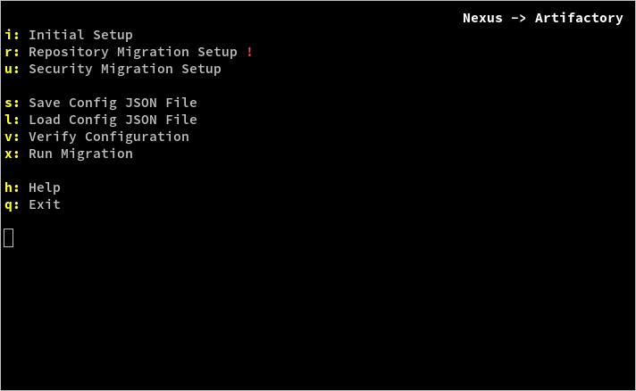
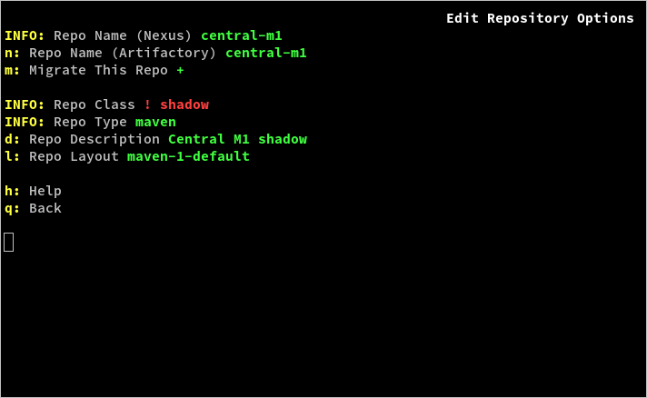

NexusToArtifactory
==================

This tool is designed to ease the transition from Sonatype Nexus to JFrog
Artifactory. It provides a simple wizard-like interface that allows you to
easily configure and run a migration of repositories, artifacts, users, and
settings from a Nexus instance to an Artifactory instance.

Installation
------------

This tool accesses the Nexus instance directly by reading the Nexus files from
the disk. Therefore, the tool should be installed on the computer running the
Nexus instance, or on a computer with access to the filesystem that the Nexus
instance is installed on.

First, install the dependencies:
- the latest version of [Python 2][]
- the latest version of the [Artifactory CLI][]
- the latest version of [PDCurses][] (on Windows only)

[Python 2]:        https://www.python.org/downloads/
[Artifactory CLI]: https://bintray.com/jfrog/artifactory-cli-go/
[PDCurses]:        http://pdcurses.sourceforge.net/

Then, clone this repository.

Usage
-----

To run the tool, run `./NexusToArtifactory.py`.

All options can be accessed by typing the appropriate key on the keyboard. The
following options are available:
- **`i`:** *Initial Setup* - Connect to the Nexus and Artifactory instances.
  This allows the tool to scan both, and come up with a default configuration
  for migration. This configuration can then be modified via the other options.
- **`r`:** *Repository Migration Setup* - Allows you to specify which
  repositories should and should not be migrated. Also, allows you to modify any
  repository to some degree (changing the name, description, layout, etc). These
  changes only affect the current configuration, and will take effect on the
  Artifactory instance when the migration is run (the Nexus instance does not
  change).
- **`s`:** *Save Configuration* - Allows you to save the current configuration
  to a JSON file. This way, you can close the tool and come back to it later, or
  you can save the current state of the migration to revert back to at a future
  time.
- **`l`:** *Load Configuration* - Allows you to load a JSON file containing a
  configuration.
- **`v`:** *Verify Configuration* - Rescan the Nexus and Artifactory instances,
  and reapply the current configuration. This should be used to check for
  incompatibilities after the Nexus instance has been modified.
- **`x`:** *Run Migration* - Run the migration.
- **`h`:** *Help* - Pressing another key after this one displays
  context-sensitive help for that option. **Note:** At the moment, no help pages
  are configured.
- **`q`:** *Exit* - Quit the tool.

The first step is to connect to the Nexus and Artifactory instances, so type `i`
to open the Initial Setup menu.

The following options are available:
- **`n`:** *Nexus Path* - The local filesystem path, where the Nexus instance is
  installed. This is generally a `sonatype-work/nexus/` folder. This path can be
  either a relative or absolute file path. If the path doesn't exist, or if it
  doesn't contain a valid Nexus install, this option will be hilighted in red.
- **`a`:** *Artifactory URL* - The URL of the Artifactory instance. If the given
  URL is not a valid Artifactory instance, this option will be hilighted in red.
- **`u`:** *Artifactory Username* - The username of an admin user on the given
  Artifactory instance.
- **`p`:** *Artifactory Password* - The password of the admin user. Unless both
  the username and password are correct, they will both be hilighted in red.
- **`h`:** *Help* - Pressing another key after this one displays
  context-sensitive help for that option. **Note:** At the moment, no help pages
  are configured.
- **`q`:** *Back* - Go back to the main menu.

Once the Nexus and Artifactory instances have both been successfully connected,
type `q` to go back to the main menu.

By this point, the tool has generated an initial configuration for the
migration, and all the settings have been set accordingly, but sometimes the
default settings need to be modified further. If there are any settings that
need to be changed, the corresponding option will be marked with a red `!`.
These must be cleared before running the migration.

In the screenshot above, there is an error in the Repository Migration Setup
menu, so type `r` to enter that menu.

The following options are available:
- **`1`:** *releases (maven)* - Typing a number key toggles whether to migrate
  the associated repository. The plus sign appears when the repository is to be
  migrated. This option also displays the package type, as well as whether the
  repository is a `(local)`, `[remote]`, `<shadow>`, or `{virtual}`. If there
  are a lot of repositories to show, they can be paged through using the left
  and right arrow keys.
- **`e`:** *Edit Repository* - Typing `e` followed by a number allows you to
  edit the associated repository.
- **`h`:** *Help* - Pressing another key after this one displays
  context-sensitive help for that option. **Note:** At the moment, no help pages
  are configured.
- **`q`:** *Back* - Go back to the main menu.

The error turns out to be in the `central-m1` repository, so type `e` and then
`6` to edit that one.

The following options are available:
- *Repo Name (Nexus)* - The repository's name on the Nexus instance. Not
  editable.
- **`n`:** *Repo Name (Artifactory)* - The repository's name on the Artifactory
  instance. Defaults to the Nexus repository name.
- **`m`:** *Migrate This Repo* - Whether to migrate this repository. This is the
  same as typing the associated number in the repository list menu.
- *Repo Class* - Whether the repository is local, remote, shadow, or virtual.
  Not editable.
- *Repo Type* - The repository's package type. Not editable.
- **`d`:** *Description* - The repository description. Defaults to the "display
  name" of the repository on the Nexus instance.
- **`l`:** *Repo Layout* - The layout of the repository. Defaults to the default
  layout for the repository's package type.
- **`r`:** *Handles Releases* - Whether this repository handles releases. Local
  and remote repositories only.
- **`s`:** *Handles Snapshots* - Whether this repository handles snapshots.
  Local and remote repositories only.
- **`u`:** *Remote URL* - The URL of the repository this one proxies. Remote
  repositories only.
- **`h`:** *Help* - Pressing another key after this one displays
  context-sensitive help for that option. **Note:** At the moment, no help pages
  are configured.
- **`q`:** *Back* - Go back to the repository list menu.

The error shows that the repository's class, `shadow`, is invalid. There are a
handful of reasons that an initial configuration might not be valid:
- A Nexus repository has a name that would be invalid in Artifactory.
- A Nexus "shadow repository" is marked for migration. These cannot be migrated,
  as Artifactory does not have an equivalent concept.
- A local NPM repository is marked for migration. These are currently not
  supported by the tool, but will be in the near future.

Since the `central-m1` repository is a shadow, it can't be migrated, so it must
be unmarked. Type `m` to unmark it, and then type `q` to go back to the
repository list. Alternatively, type `q` to go back to the list, and then type
`6` to unmark the repository.

Now, the error is gone. The error has disappeared on the main menu as well, and
the migration can now be run.

Features
--------

This tool is still in early development, and plenty of features are not yet
implemented. The following is an incomplete list of features that are currently
in development, and should be added to the tool soon:
- migrate users, groups, and privileges
- migrate scheduled tasks
- migrate other instance-wide settings
- support paid Nexus features, such as custom metadata
- migrate local NPM repositories
- modify virtual repository child lists
- modify repository package types
- remove the dependency on the Artifactory CLI
- obfuscate passwords in save files
- add help pages to all commands
